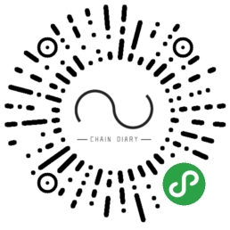

# Chain diary mini program

 * [中文](#中文)
 * [配置](#配置)
	* [下载依赖](#下载依赖)
	    * [本地开发](#本地开发)
	    * [编译生产环境](#编译生产环境)
 * [English](#English)
	* [configure](#configure)
    * [Project setup](#Project setup)
	    * [Compiles and hot-reloads for development](#Compiles and hot-reloads for development)
	    * [Compiles and minifies for production](#Compiles and minifies for production)

## 中文

链记API

链记小程序安装：




#### 配置
```
你需要自己把 接口地址和微信 appid 替换成自己的
```

#### 下载依赖
```
npm install
```

##### 本地开发
```
npm run dev:mp-weixin
```

##### 编译生产环境
```
npm run build:mp-weixin
```

## English

Chain diary API

Install chain diary mini program：


### configure
```
	You need to replace the interface address and wechat appid with your own
```
#### Project setup
```
npm install
```

##### Compiles and hot-reloads for development
```
npm run dev:mp-weixin
```

##### Compiles and minifies for production
```
npm run build:mp-weixin
```

